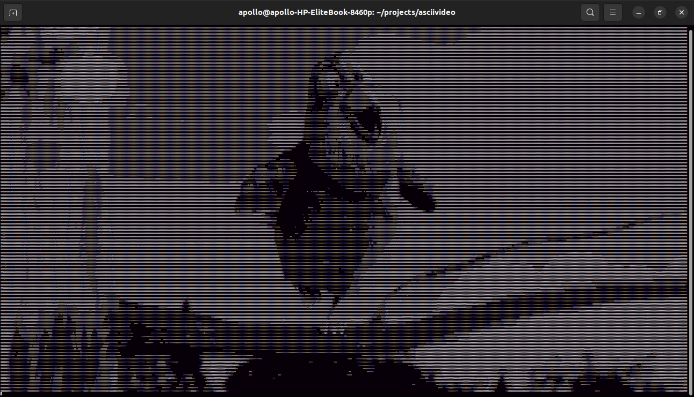

# The .asciivideo Codec 📺
### Feature rich video player with few dependencies. Works great with tty machines 🚀

# WARNING ⚠️
## This project is not fully functional yet and bugs do appear quite often. This is simply a testing phase to find these bugs

# Install instructions

### Currently we only support debian based distros but unoffical support for Arch, OpenSUSE, and other linux distrobutions are planned

1. ``sudo apt-get update -y``
2. ``sudo apt install ffmpeg python3 python3-pip -y # Install python and pip``
3. ``python3 -m pip install --upgrade Pillow --break-system-packages # Recent changes to Pillow might cause this to give an error but if it works, Great``
4. ``python3 -m pip install tqdm numpy pygame --break-system-packages # Install depedencies``
5. ``sudo apt install git -y``
6. ``git clone --depth=1 https://github.com/Ubuntufanboy/ascii-video-player # Clone repo``
7. ``cd ascii-video-player``
8. ``cd src``

# Usage guide

1. Have an mp4 file in the same folder or be prepared to provide the full video path
2. run ``python3 mp4_to_asciivideo.py input_video_filename.mp4``
3. run ``python3 play.py input_video_filename.asciivideo``

## PLEASE report any bugs to me in an issue (No such thing as a dumb question)!

I appriciate the support! 🛐
